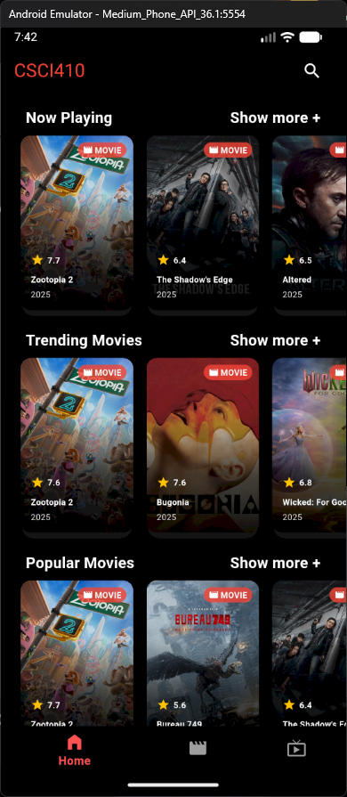
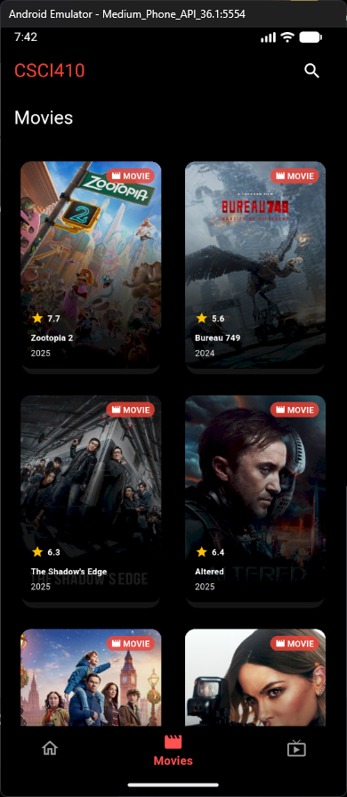
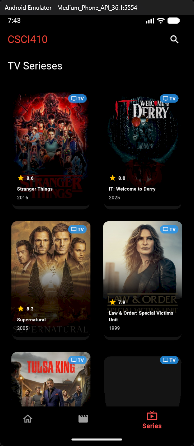
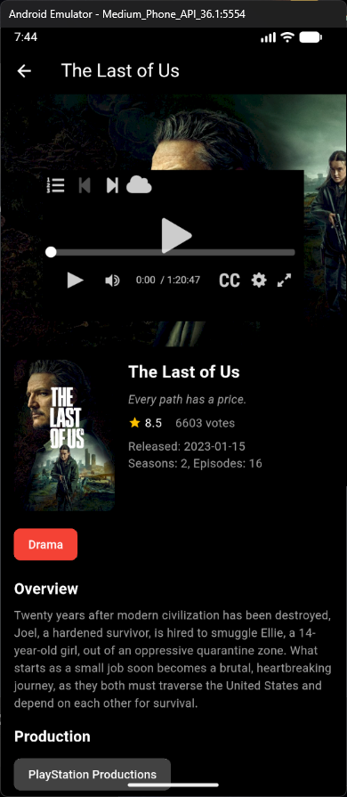
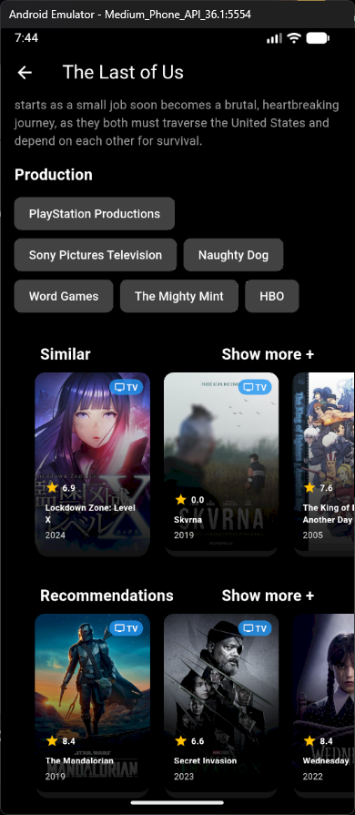

# YMOVIES - Movies & TV Series App

A feature-rich Flutter mobile application for discovering and streaming movies and TV series. The app provides comprehensive entertainment information with seamless streaming capabilities.


## 📱 Features

### 🏠 Home Page

- **Curated Sections**: Now Playing, Top Rated, Popular, Trending.
- **Show More**: Expandable sections with "Show More" functionality
- **Horizontal Scrolling**: Smooth navigation through content sections
  

### 🎭 Content Pages

- **Movies Page**: Dedicated movies listing with pagination
- **TV Series Page**: Dedicated TV series listing with pagination
- **Pagination**: Next/Previous page navigation for both movies and TV series
  
  

### 🔍 Search Functionality

- **Universal Search**: Search across both movies and TV series
- **Cross-platform**: Search covers all available content

  
  

### 📺 Details & Streaming

- **Detailed Views**: Comprehensive movie/TV series information
- **Backdrop Gallery**: High-quality backdrop images
- **Integrated Streaming**: WebView-powered video player using external APIs
- **Content Recommendations**: Similar titles and recommendations sections
  
  

## Stack

### Core Dependencies

```yaml
dependencies:
  flutter:
    sdk: flutter
  http: ^1.1.0
  webview_flutter: ^4.4.2
  webview_flutter_android: ^3.3.0
  webview_flutter_wkwebview: ^3.3.0
  flutter_inappwebview: ^6.0.0
```
