# YMOVIES - Movies & TV Series App

A feature-rich Flutter mobile application for discovering and streaming movies and TV series. The app provides comprehensive entertainment information with seamless streaming capabilities.


## 📱 Features

### Login/SignUp.

- **SignUp**: A new user can sign up a new account, to save their loved titles, and add to their watchlist.
- **Login**: A user can login to their account, and see their lists, they can change their profile, email, name, and password.
- **Consistency**: Login data are saved to the local storage, so the user dont login everytime the app starts.

#### Login

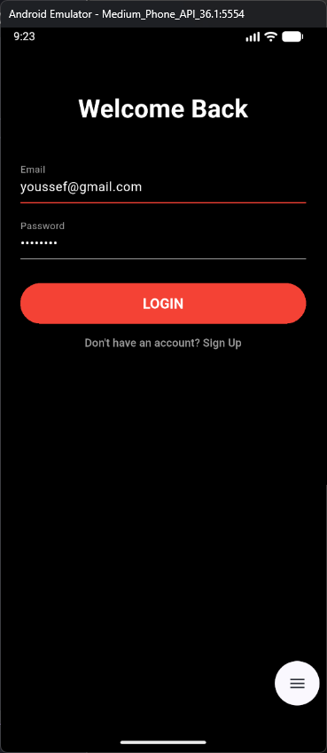

#### SignUp

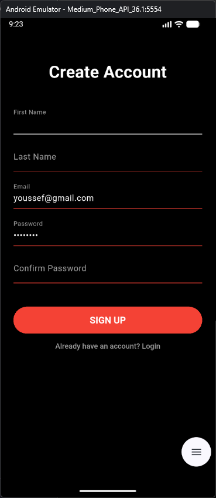

### 🏠 Home Page

- **Curated Sections**: Now Playing, Top Rated, Popular, Trending.
- **Show More**: Expandable sections with "Show More" functionality
- **Horizontal Scrolling**: Smooth navigation through content sections

#### Home page

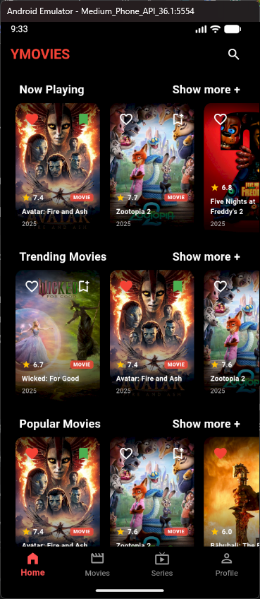

### 🎭 Content Pages

- **Movies Page**: Dedicated movies listing with pagination
- **TV Series Page**: Dedicated TV series listing with pagination
- **Pagination**: Next/Previous page navigation for both movies and TV series

#### Movies

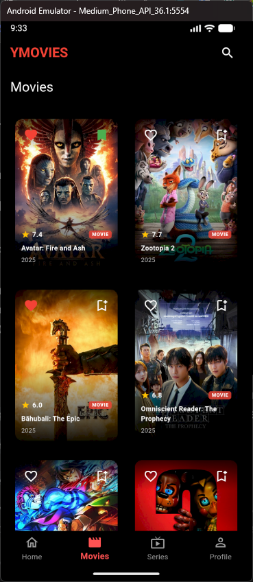

#### Series

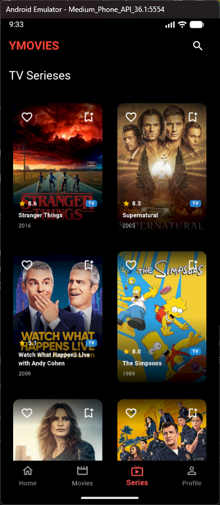

### 🔍 Search Functionality

- **Universal Search**: Search across both movies and TV series
- **Cross-platform**: Search covers all available content

#### Search Page a series

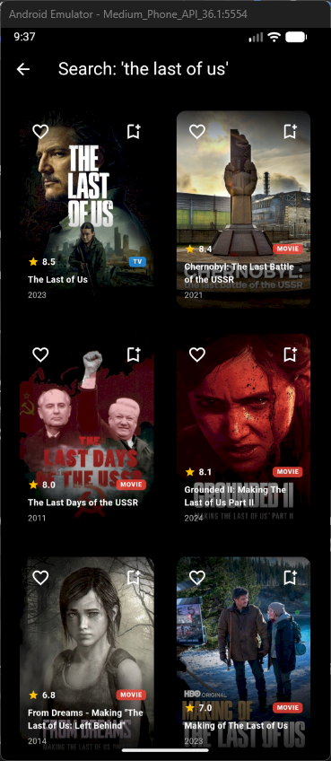

#### Search Page a movie

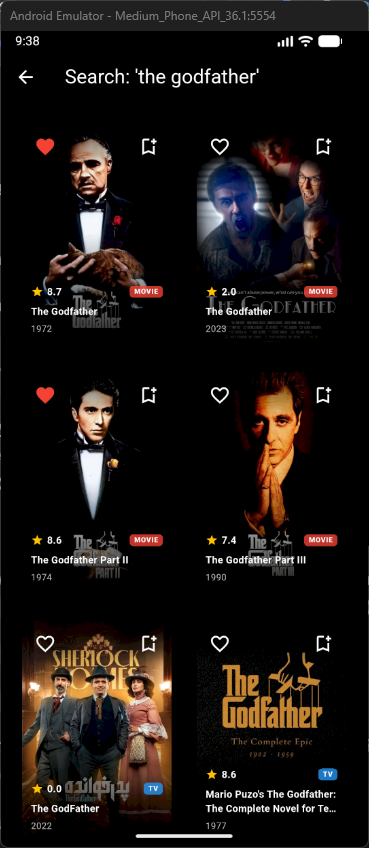

### 📺 Details & Streaming

- **Detailed Views**: Comprehensive movie/TV series information
- **Backdrop Gallery**: High-quality backdrop images
- **Integrated Streaming**: WebView-powered video player using external APIs
- **Content Recommendations**: Similar titles and recommendations sections

#### Detail View

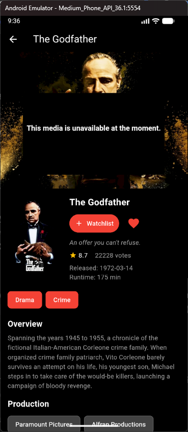

#### Similar and Recomendations

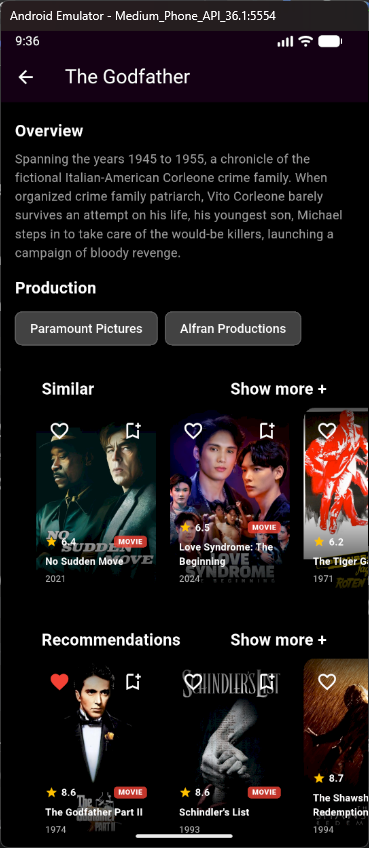

### Loved, and Watchlist

- **Loved List**: A user Can Easily add/remove a title from their loved list from anywhere on the app, and they can see the title hat was added, they can see the full list.
- **Watchlist**: A user Can Easily add/remove a title from their watchlist from anywhere on the app, and they can see the title hat was added, they can see the full list.

#### Loved List

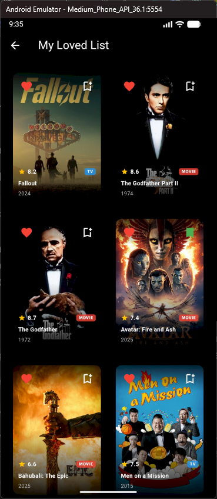

#### Watchlist

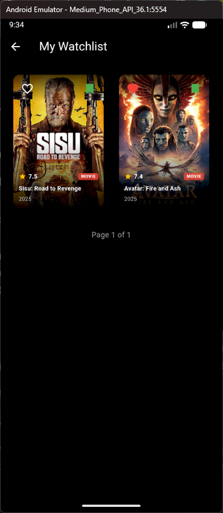

## Stack

### Frontend

- **Flutter**: Fluter for the frontend, it can be build either an android or ios app, or even web (tested only on android)

### Backend

- **PHP**: Used PHP model architecture, using model, and api folders, its a simple api, that only have user, watchlist, loved, and login history.

## How to Setup

### Backend

#### Make sure you have an apachi server and mysql running

- **Apachi Server**: XAMPP or MAMP or LAMPP

#### Database

- **Mysql**: Make sure you imported the database to mysql phpmyadmin from /backend/ymovies.sql.

**XAMPP** or **MAMP** or **LAMPP**

```bash
cd ymovies/frontend
flutter pub get
```

#### Start the emulator

```bash
flutter emulators --launch Name_of_your_Emulator
```

#### Run the app

```bash
flutter run
```

### Frontend

#### First getting the dependencies

```bash
cd ymovies/frontend
flutter pub get
```

#### Start the emulator

```bash
flutter emulators --launch Name_of_your_Emulator
```

#### Run the app

```bash
flutter run
```
